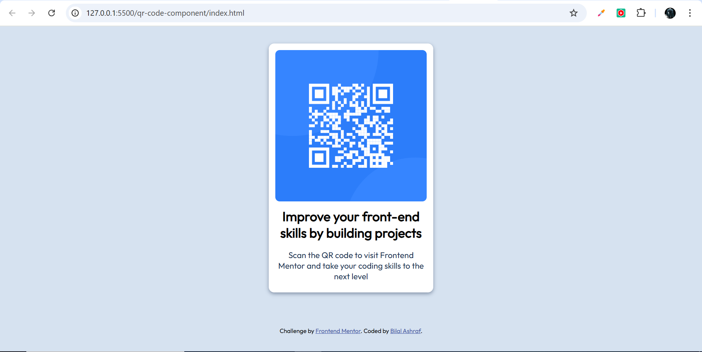
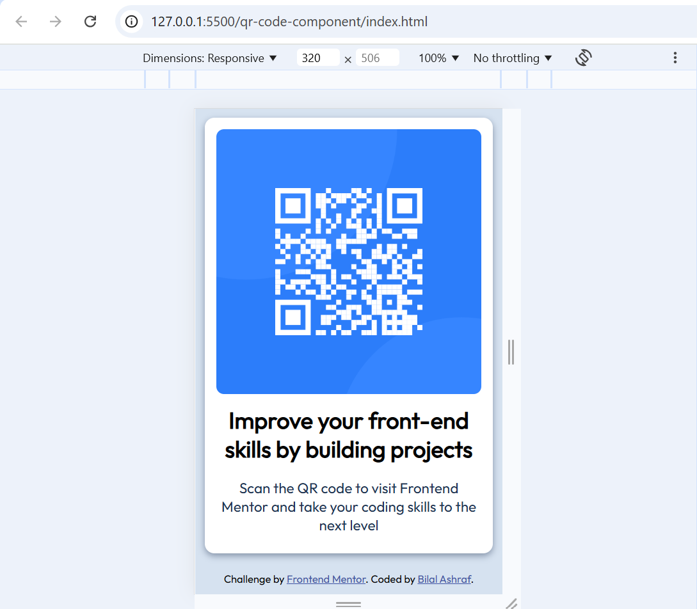

# Frontend Mentor - QR code component solution

This is a solution to the [QR code component challenge on Frontend Mentor](https://www.frontendmentor.io/challenges/qr-code-component-iux_sIO_H). Frontend Mentor challenges help you improve your coding skills by building realistic projects. 

## Table of contents

- [Overview](#overview)
  - [Screenshot](#screenshot)
  - [Links](#links)
- [My process](#my-process)
  - [Built with](#built-with)
  - [What I learned](#what-i-learned)
  - [Continued development](#continued-development)
  - [Useful resources](#useful-resources)
- [Author](#author)
- [Acknowledgments](#acknowledgments)


## Overview

### Screenshot





### Links

- Solution URL: [Add solution URL here](https://github.com/MBilal-21/qr-code-component-task.git)
- Live Site URL: [Add live site URL here](https://mbilal-21.github.io/qr-code-component-task/)

## My process

### Built with

- Semantic HTML5 markup
- CSS custom properties
- CSS Grid
- Mobile-first workflow


### What I learned

This is was simple challange, I have a new idea and that is to enhance it BY making an page where user add an link to  create a its QR-code and can download a QR-code image to share.

and i learned general issue like role="main"  for that use use main tag and  role="contentinfo" for that we use footer tag, and in this challange it is not necessory but i know this is warning and this help in SEO for website
```html
<div role="main" class="qr-code"></div>
<div role="contentinfo" class="attribution"></div>
```


### Continued development
Making an page where user add an link to  create a its QR-code and can download a QR-code image to share.


### Useful resources


## Author

- GitHuB Accout - [MBilal-21](https://github.com/MBilal-21)
- Frontend Mentor - [@MBilal-21](https://www.frontendmentor.io/profile/MBilal-21)
- Twitter - [@yourusername](https://www.twitter.com/yourusername)


## Acknowledgments


